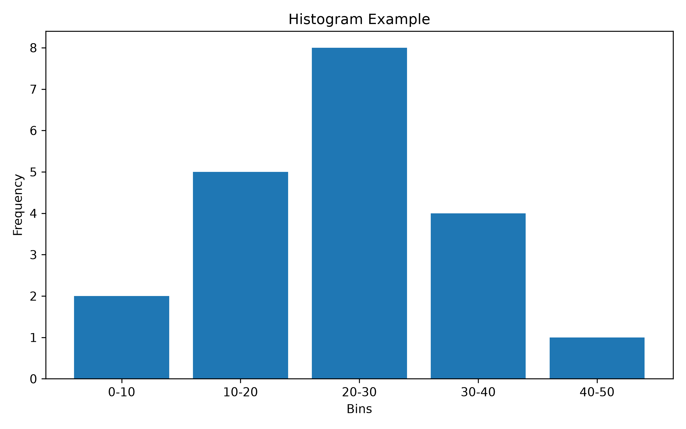

# Histograms

## One-Sentence Summary

A histogram is a visual representation of where data values tend to cluster.

---

## What Is It?

A histogram is a graph that shows how data is distributed.

Instead of displaying every individual data point, a histogram groups data into ranges called bins and counts how many values fall into each bin.

This helps us quickly understand the shape of a dataset.

A histogram answers questions like:

- Where do most values occur?
- Are the values spread out or concentrated?
- Are there any unusual values?
- Does the data form one group or multiple groups?

---

## Why Should I Care?

Before performing any statistical analysis or building any machine learning model, it is important to understand the data.

Histograms are often the first visualization a data scientist creates because they can reveal:

- Patterns
- Clusters
- Outliers
- Skewed distributions
- Data quality issues

Without a histogram, important insights may remain hidden inside a long list of numbers.

---

## Intuition

Imagine you have a list of exam scores:

42, 45, 47, 51, 53, 55, 62, 64, 65, 71, 73, 75, 82, 85, 88

Looking at the raw numbers, it is difficult to immediately understand how the scores are distributed.

Now group them into ranges:

| Score Range | Count |
|-------------|--------|
| 40–49 | 3 |
| 50–59 | 3 |
| 60–69 | 3 |
| 70–79 | 3 |
| 80–89 | 3 |

Suddenly a pattern appears.

A histogram is simply a visual version of this grouping process.

Think of it as putting similar values into buckets and counting how many values land in each bucket.

---

## Analogy

Imagine a concert venue.

Fans arrive throughout the evening.

Instead of recording every arrival time individually, you group people into time ranges:

| Time Window | Number of Fans |
|-------------|----------------|
| 6:00–6:30 | 50 |
| 6:30–7:00 | 120 |
| 7:00–7:30 | 250 |
| 7:30–8:00 | 80 |

The time ranges become bins.

The number of fans becomes the height of the bars.

The resulting chart is essentially a histogram.

---

## Rock & Metal Corner

Imagine analyzing the length of songs in a large metal playlist.

Most songs might be between:

- 3 and 5 minutes

Some songs might be:

- 6 to 8 minutes

A few progressive metal epics might be:

- 15 to 20 minutes

A histogram would immediately reveal:

- Where most songs are concentrated
- How much variation exists
- Whether there are unusual outliers

That rare 20-minute Dream Theater style masterpiece would stand out as a distant bar in the distribution.

---

## Mathematical Definition

A histogram consists of:

1. Bins (ranges of values)
2. Frequencies (counts of observations)

Suppose we have the dataset:

1, 2, 2, 2, 3, 3, 4, 5, 5

We can create the following bins:

| Bin | Frequency |
|------|-----------|
| 1–2 | 4 |
| 3–4 | 3 |
| 5–6 | 2 |

A histogram plots:

- Bins on the x-axis
- Frequencies on the y-axis

The height of each bar indicates how many observations fall inside the corresponding bin.

---

## Worked Example

Suppose an online store records the following order values:

12, 15, 18, 20, 22, 25, 28, 30, 32, 35

Create bins:

| Order Value Range | Count |
|-------------------|--------|
| 10–19 | 3 |
| 20–29 | 4 |
| 30–39 | 3 |

The histogram would show that most purchases occurred between 20 and 29.

This insight is much easier to understand visually than by reading the raw numbers.

---

## Visual Explanation

Imagine a histogram that looks like this:

The histogram above shows how observations are distributed across different value ranges.

The taller the bar, the more observations belong to that range.

Tall bars indicate where data is concentrated.

Short bars indicate where data is rare.

---

## The StatQuest Takeaway

Histograms are often the very first step in understanding a dataset.

Before calculating averages, variances, correlations, or building machine learning models, it is useful to visualize how the data is distributed.

Histograms help us see structure that is difficult to notice from raw numbers alone.

---

## Machine Learning Connection

Histograms play an important role during Exploratory Data Analysis (EDA).

Data scientists use them to:

- Understand feature distributions
- Detect outliers
- Identify skewed data
- Check data quality
- Decide whether transformations are required

Examples:

- Customer ages
- Product prices
- Transaction amounts
- Sensor readings

Understanding distributions often leads to better feature engineering and better models.

---

## AI / LLM / RAG Connection

Histograms appear frequently when analyzing modern AI systems.

### Embedding Analysis

Teams may visualize:

- Similarity scores
- Cosine distances
- Retrieval scores

to understand how embeddings behave.

### RAG Evaluation

A histogram of retrieval scores can reveal:

- Most chunks are highly relevant
- Most chunks are irrelevant
- Multiple clusters exist

This helps diagnose retrieval quality.

### LLM Evaluation

Histograms can be used to analyze:

- User ratings
- Hallucination scores
- Response quality scores
- Evaluation benchmark results

before deeper statistical analysis takes place.

---

## Common Misconceptions

### Histograms and Bar Charts Are the Same

They are not.

Bar charts compare categories.

Histograms represent distributions of continuous values.

---

### More Bins Are Always Better

Too many bins create noise.

Too few bins hide patterns.

Choosing an appropriate bin size is important.

---

### Histograms Explain Everything

Histograms provide a useful overview.

However, additional statistics are usually needed for deeper analysis.

---

## Pulkit's Mental Model

A histogram is a bird's-eye view of where the data likes to hang out.

---

## Interview Questions

### What is a histogram?

A histogram is a graph that shows the distribution of numerical data by grouping observations into ranges called bins.

### What is a bin?

A bin is a range used to group observations together.

### What is the difference between a histogram and a bar chart?

Histograms show distributions of continuous data.

Bar charts compare discrete categories.

### Why are histograms important in machine learning?

They help identify distributions, outliers, skewness, and data quality issues before model training.

---

## Related Topics

- Probability Distributions
- Mean
- Variance
- Standard Deviation
- Normal Distribution

---

## References

- StatQuest: Histograms, Clearly Explained
- Statistics Fundamentals Playlist (StatQuest)
